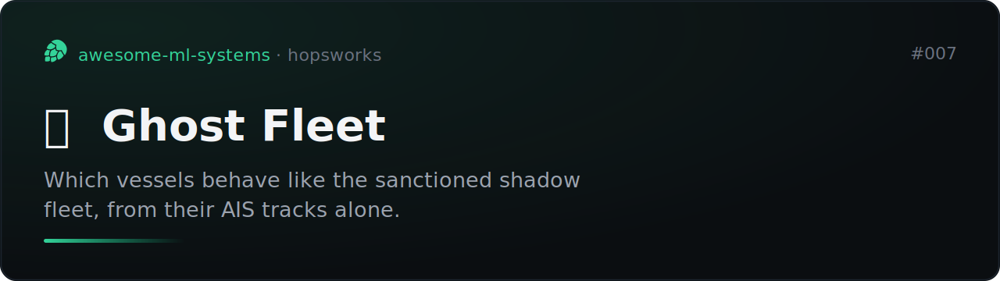
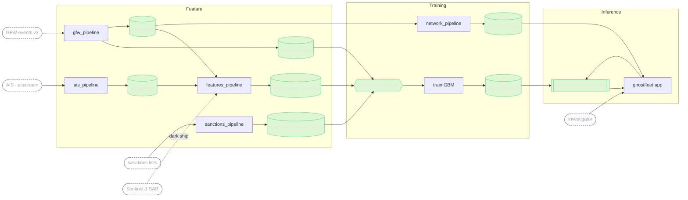

# Ghost Fleet



[](https://github.com/MagicLex/awesome-ml-systems)
[](https://www.hopsworks.ai/)

Who is hiding on the ocean? A real-time system that scores vessels in the Baltic
Sea, the Gulf of Finland and the Laconian Gulf by how much their **behaviour**
resembles the sanctioned shadow fleet: AIS gaps, offshore loitering,
ship-to-ship rendezvous, flag-hopping, laden and ballast draught swings. The
label is weak (open sanctions lists, by IMO), so the model catches vessels that
*behave like* the listed ones but are not yet listed. Live and honest, it scores
**9.4x above a blind sanctions-list lookup** (ROC-AUC 0.92). The reveal is the
**network**: the rings of vessels that keep meeting in the dark.

## The result

`shadow_vessel`, a gradient-boosted classifier on `vessel_track_features`
(behavioural signals fused point-in-time with GFW events and identity). The
label is sanctions membership by IMO, so it is a lagging, incomplete proxy, and
the honest metric is the lift over simply looking a vessel up on the list, on a
population split, not a random row split.

| metric | value |
|---|---:|
| lift over a blind sanctions-list lookup | **9.4x** |
| ROC-AUC (population split) | 0.92 |

The score is behaviour, not list membership, by design. A Cameroon-flag vessel
running the shadow-fleet playbook scores 0.96. A sanctioned Russian vessel
behaving normally scores 0.002. It reports a **coordination and evasion signal,
never proof of a crime**, and every flagged vessel links back to the raw
source-of-truth services for a human to judge.

## Caveats

Read these before quoting the number anywhere.

- **The label is a proxy.** "Positive" means the vessel's IMO appears on a
  consolidated sanctions list. That list lags real behaviour and misses vessels
  never listed, which is exactly the population the model is meant to surface.
  Similarity to sanctioned behaviour is not an accusation.
- **Selection.** Coverage is three sea regions and the vessels their AIS feed
  reaches. A ship that goes fully dark leaves no AIS features at all; the SAR
  layer is what catches a radar contact with no AIS behind it.
- **Behaviour only.** The model never sees list membership as a feature, so a
  listed vessel that behaves normally scores low. That is the point, and it is
  also why the headline is lift, not an absolute score.

## Architecture

An FTI (feature, training, inference) system on Hopsworks. Every source arrives
on its own clock and they are fused point-in-time, with no leakage and no
train/serve skew. Serving fuses the vessel's **precomputed** history with
**on-demand** features computed from its live track in the request; that fusion
is the showpiece.



The sources, each on a different cadence:

| source | cadence | role |
|---|---|---|
| AIS (aisstream.io) | seconds | position, speed, draught, destination |
| GFW events v3 | hourly | AIS gaps, loitering, STS encounters, port visits, identity |
| consolidated sanctions | daily | the weak ground-truth label, by IMO |
| open-meteo | hourly | weather context for loitering |
| Sentinel-1 SAR | satellite pass | radar contact with no AIS, a truly dark ship |

The file-by-file map:

```
ghost_features.py             shared, skew-free: AIS normalize + featurize + reasons
collect/ais_stream.py         aisstream websocket reader
pipelines/ais_pipeline.py         F1  live AIS -> ais_position                (Hopsworks job)
pipelines/gfw_pipeline.py         F3  GFW identity + events -> two FGs         (Hopsworks job)
pipelines/sanctions_pipeline.py   F4  sanctions lists -> sanctioned_vessel     (Hopsworks job)
pipelines/features_pipeline.py    F2  behaviour features -> vessel_track_features (Hopsworks job)
pipelines/network_pipeline.py     T2  encounter graph -> vessel_network        (Hopsworks job)
pipelines/train.py                T1  feature view -> shadow_vessel -> registry (Hopsworks job)
serving/                          I1  shadowscorer predictor + KServe deploy
app/                              A1  ghostfleet oceanic app
tools/                            schedule.py, build_envs.py
reqs/ghost-fleet.md               the FTI specification
```

## Reproduce

Clone into a Hopsworks project on the `/hopsfs/...` FUSE mount. Paths
self-derive; nothing is hardcoded to a username. Keys live in Hopsworks secrets
(`AISSTREAM_KEY`, `GFW_TOKEN`), never in the repo.

```bash
make envs            # clone the collector env (+ websockets)
make sanctions-job   # label FG
make collect-job     # live AIS collector
make gfw-job         # GFW identity + events
make features-job    # vessel behaviour features
make train-job       # shadow_vessel model
make network-job     # shadow-fleet encounter graph
make serve           # KServe deployment
make app             # oceanic app
```

## The demo

`ghostfleet`: an oceanic map that scores vessels live. Each ship carries its
shadow score and the plain-language reasons behind it (gap hours, loiter time,
STS rendezvous, draught swing), and the attention rail ranks who is behaving
most like the shadow fleet right now. The reveal is the network overlay: the
rings of vessels that keep meeting in the dark, drawn from the encounter graph.
Every flagged vessel links out to the raw sources, because the system triages
for open-source investigation, it does not accuse.
