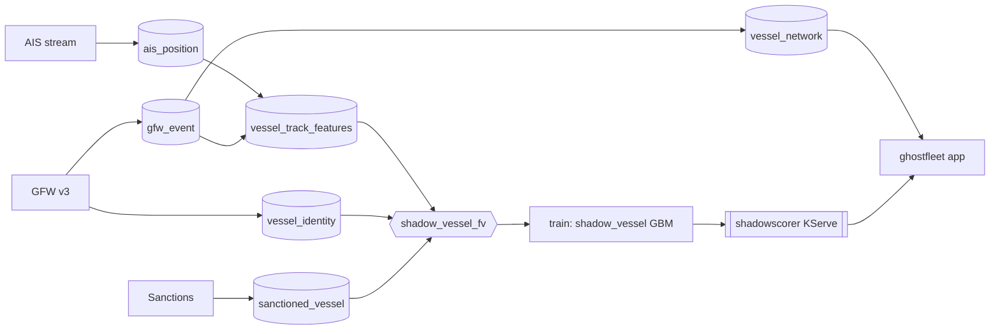

# Ghost Fleet

Who is hiding on the ocean? A real-time ML system that scores vessels in the
Baltic Sea, the Gulf of Finland and the Laconian Gulf by how much their
**behaviour** resembles the sanctioned shadow fleet: AIS gaps, offshore
loitering, ship-to-ship rendezvous, flag-hopping, laden/ballast draught swings.
The reveal is the **network**: the rings of vessels that keep meeting in the
dark.

The label comes from open sanctions lists (OpenSanctions: OFAC + EU + UK + more),
so the model catches vessels that *behave like* the listed ones but are not yet
listed. It reports a **coordination and evasion signal, never proof of a crime**,
and the headline is the lift over a blind sanctions-list lookup, not an absolute
score.

## Why the feature store is the point

Every source arrives on a different clock and they are fused point-in-time with
no leakage and no train/serve skew:

| source | cadence | role |
|---|---|---|
| AIS (aisstream.io) | seconds | position, speed, draught, destination |
| GFW events v3 | hourly | AIS gaps, loitering, STS encounters, port visits, identity |
| Consolidated Sanctions | daily | the weak ground-truth label (by IMO) |
| open-meteo | hourly | weather context for loitering |
| Sentinel-1 SAR (v2) | satellite pass | radar contact with no AIS = a truly dark ship |

Serving fuses the vessel's **precomputed** history with **on-demand** features
computed from its live track in the request. That fusion is the showpiece.

## FTI flow



## Layout

```
ghost_features.py          shared, skew-free: AIS normalization + vessel featurization + reasons
collect/ais_stream.py      aisstream websocket reader
pipelines/
  ais_pipeline.py          F1  live AIS -> ais_position
  gfw_pipeline.py          F3  GFW identity + events -> vessel_identity, gfw_event
  sanctions_pipeline.py    F4  sanctions lists -> sanctioned_vessel (label)
  features_pipeline.py     F2  behaviour MITs -> vessel_track_features
  network_pipeline.py      T2  encounter graph -> vessel_network
  train.py                 T1  shadow_vessel classifier + eval
serving/                   I1  shadowscorer predictor + deploy
app/                       A1  ghostfleet oceanic app
tools/                     schedule.py, build_envs.py
reqs/ghost-fleet.md        the specification
```

## Run

Keys live in Hopsworks secrets (`AISSTREAM_KEY`, `GFW_TOKEN`), never in the repo.

```
make envs            # clone the collector env (+ websockets)
make sanctions-job   # label FG
make collect-job     # live AIS collector
make gfw-job         # GFW identity + events
make features-job    # vessel behaviour features
make train-job       # shadow_vessel model
make network-job     # shadow-fleet graph
make serve           # KServe deployment
make app             # oceanic app
```

Honesty and ethics: this ranks vessels by behavioural similarity to sanctioned
ships as a triage signal for open-source investigation. It is not an accusation.
Every flagged vessel links to the raw source-of-truth services.
